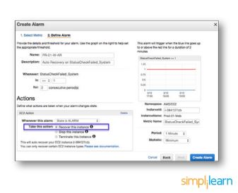

\1. Define and explain the three basic types of cloud services and the AWS products that are built based on them?

The three basic types of cloud services are:

- Computing
- Storage
- Networking

Here are some of the AWS products that are built based on the three cloud service types:

Computing - These include EC2, Elastic Beanstalk, Lambda, Auto-Scaling, and Lightsat.

Storage - These include S3, Glacier, Elastic Block Storage, Elastic File System.

Networking - These include VPC, Amazon CloudFront, Route53

\2. What is the relation between the Availability Zone and Region?

AWS regions are separate geographical areas, like the US-West 1 (North California) and Asia South (Mumbai). On the other hand, availability zones are the areas that are present inside the regions. These are generally isolated zones that can replicate themselves whenever required.

\3. What is auto-scaling?

[Auto-scaling](https://www.simplilearn.com/tutorials/aws-tutorial/aws-auto-scaling "Auto-scaling") is a function that allows you to provision and launch new instances whenever there is a demand. It allows you to automatically increase or decrease resource capacity in relation to the demand.

\4. What is geo-targeting in CloudFront?

Geo-Targeting is a concept where businesses can show personalized content to their audience based on their geographic location without changing the URL. This helps you create customized content for the audience of a specific geographical area, keeping their needs in the forefront.

\5. What are the steps involved in a CloudFormation Solution?

Here are the steps involved in a CloudFormation solution:

1. Create or use an existing CloudFormation template using JSON or YAML format.
1. Save the code in an S3 bucket, which serves as a repository for the code.
1. Use [AWS CloudFormation](https://www.simplilearn.com/tutorials/aws-tutorial/aws-cloudformation "AWS CloudFormation") to call the bucket and create a stack on your template. 
1. CloudFormation reads the file and understands the services that are called, their order, the relationship between the services, and provisions the services one after the other.

\6. How do you upgrade or downgrade a system with near-zero downtime?

You can upgrade or downgrade a system with near-zero downtime using the following steps of migration:

- Open EC2 console
- Choose Operating System AMI
- Launch an instance with the new instance type
- Install all the updates
- Install applications
- Test the instance to see if it’s working
- If working, deploy the new instance and replace the older instance
- Once it’s deployed, you can upgrade or downgrade the system with near-zero downtime.

Take home these interview Q&As and get much more. Download the complete AWS Interview Guide here:

\7. What are the tools and techniques that you can use in AWS to identify if you are paying more than you should be, and how to correct it?

You can know that you are paying the correct amount for the resources that you are using by employing the following resources:

- Check the Top Services Table

It is a dashboard in the cost management console that shows you the top five most used services. This will let you know how much money you are spending on the resources in question.

- Cost Explorer

There are cost explorer services available that will help you to view and analyze your usage costs for the last 13 months. You can also get a cost forecast for the upcoming three months.

- AWS Budgets

This allows you to plan a budget for the services. Also, it will enable you to check if the current plan meets your budget and the details of how you use the services.

- Cost Allocation Tags

This helps in identifying the resource that has cost more in a particular month. It lets you organize your resources and cost allocation tags to keep track of your AWS costs.

Learn how to design, plan, and scale cloud implementation and excel in the field of cloud computing with [Simplilearn’s Post Graduate Program in Cloud Computing](https://www.simplilearn.com/pgp-cloud-computing-certification-training-course "Simplilearn’s Post Graduate Program in Cloud Computing").

\8. Is there any other alternative tool to log into the cloud environment other than console?

The that can help you log into the AWS resources are:

- Putty
- AWS CLI for Linux
- AWS CLI for Windows
- AWS CLI for Windows CMD
- AWS SDK
- Eclipse

\9. What services can be used to create a centralized logging solution?

The essential services that you can use are Amazon CloudWatch Logs, store them in Amazon S3, and then use Amazon Elastic Search to visualize them. You can use Amazon Kinesis Firehose to move the data from Amazon S3 to Amazon ElasticSearch.

\10. What are the native AWS Security logging capabilities?

Most of the AWS services have their logging options. Also, some of them have an account level logging, like in AWS CloudTrail, AWS Config, and others. Let’s take a look at two services in specific:

AWS CloudTrail

This is a service that provides a history of the AWS API calls for every account. It lets you perform security analysis, resource change tracking, and compliance auditing of your AWS environment as well. The best part about this service is that it enables you to configure it to send notifications via AWS SNS when new logs are delivered.

AWS Config 

This helps you understand the configuration changes that happen in your environment. This service provides an AWS inventory that includes configuration history, configuration change notification, and relationships between AWS resources. It can also be configured to send information via AWS SNS when new logs are delivered.

\11. What is a DDoS attack, and what services can minimize them?

DDoS is a cyber-attack in which the perpetrator accesses a website and creates multiple sessions so that the other legitimate users cannot access the service. The native tools that can help you deny the DDoS attacks on your AWS services are:

- AWS Shield
- AWS WAF
- Amazon Route53
- [Amazon CloudFront](https://www.simplilearn.com/tutorials/aws-tutorial/aws-cloudfront "Amazon CloudFront")
- ELB
- VPC

\12. You are trying to provide a service in a particular region, but you do not see the service in that region. Why is this happening, and how do you fix it?

Not all Amazon AWS services are available in all regions. When Amazon initially launches a new service, it doesn’t get immediately published in all the regions. They start small and then slowly expand to other regions. So, if you don’t see a specific service in your region, chances are the service hasn’t been published in your region yet. However, if you want to get the service that is not available, you can switch to the nearest region that provides the services.

\13. How do you set up a system to monitor website metrics in real-time in AWS?

Amazon CloudWatch helps you to monitor the application status of various AWS services and custom events. It helps you to monitor:

- State changes in Amazon EC2
- Auto-scaling lifecycle events
- Scheduled events
- AWS API calls
- Console sign-in events

\14. What are the different types of virtualization in AWS, and what are the differences between them?

The three major types of virtualization in AWS are: 

- Hardware Virtual Machine (HVM)

It is a fully virtualized hardware, where all the virtual machines act separate from each other. These virtual machines boot by executing a master boot record in the root block device of your image.

- Paravirtualization (PV)

Paravirtualization-GRUB is the bootloader that boots the PV AMIs. The PV-GRUB chain loads the kernel specified in the menu.

- Paravirtualization on HVM

PV on HVM helps operating systems take advantage of storage and network I/O available through the host.

\15. Name some of the AWS services that are not region-specific

AWS services that are not region-specific are:

- IAM
- Route 53
- Web Application Firewall 
- CloudFront

\16. What are the differences between NAT Gateways and NAT Instances?

While both NAT Gateways and NAT Instances serve the same function, they still have some key differences.

\17. What is CloudWatch?

The Amazon CloudWatch has the following features:

- Depending on multiple metrics, it participates in triggering alarms.
- Helps in monitoring the AWS environments like CPU utilization, EC2, Amazon RDS instances, Amazon SQS, S3, Load Balancer, SNS, etc.

AWS Interview Questions for Amazon EC2

\19. What is the difference between stopping and terminating an EC2 instance? 

While you may think that both stopping and terminating are the same, there is a difference. When you stop an EC2 instance, it performs a normal shutdown on the instance and moves to a stopped state. However, when you terminate the instance, it is transferred to a stopped state, and the EBS volumes attached to it are deleted and can never be recovered. 

\20. What are the different types of EC2 instances based on their costs?

The three types of EC2 instances are:

- On-demand Instance

It is cheap for a short time but not when taken for the long term

- Spot Instance

It is less expensive than the on-demand instance and can be bought through bidding. 

- Reserved Instance

If you are planning to use an instance for a year or more, then this is the right one for you.

\21. How do you set up SSH agent forwarding so that you do not have to copy the key every time you log in?

Here’s how you accomplish this:

1. Go to your PuTTY Configuration
1. Go to the category SSH -> Auth
1. Enable SSH agent forwarding to your instance

\22. What are Solaris and AIX operating systems? Are they available with AWS?

Solaris is an operating system that uses SPARC processor architecture, which is not supported by the public cloud currently. 

AIX is an operating system that runs only on Power CPU and not on Intel, which means that you cannot create AIX instances in EC2.

Since both the operating systems have their limitations, they are not currently available with AWS.

\23. How do you configure CloudWatch to recover an EC2 instance?

Here’s how you can configure them:

- Create an Alarm using Amazon CloudWatch
- In the Alarm, go to Define Alarm -> Actions tab
- Choose Recover this instance option

\24. What are the common types of AMI designs?

There are many types of AMIs, but some of the common AMIs are:

- Fully Baked AMI
- Just Enough Baked AMI (JeOS AMI)
- Hybrid AMI

\25. What are Key-Pairs in AWS?

The Key-Pairs are password-protected login credentials for the Virtual Machines that are used to prove our identity while connecting the Amazon EC2 instances. The Key-Pairs are made up of a Private Key and a Public Key which lets us connect to the instances.

AWS Interview Questions for S3

\26. How can you recover/login to an EC2 instance for which you have lost the key?

Follow the steps provided below to recover an EC2 instance if you have lost the key:

1. Verify that the EC2Config service is running
1. Detach the root volume for the instance
1. Attach the volume to a temporary instance
1. Modify the configuration file
1. Restart the original instance

\27. What are some critical differences between AWS S3 and EBS?

Here are some differences between AWS S3 and EBS

\28. How do you allow a user to gain access to a specific bucket?

You need to follow the four steps provided below to allow access. They are:

1. Categorize your instances
1. Define how authorized users can manage specific servers.
1. Lockdown your tags
1. Attach your policies to IAM users

\29. How can you monitor S3 cross-region replication to ensure consistency without actually checking the bucket?

Follow the flow diagram provided below to monitor S3 cross-region replication:

\30. What is SnowBall?

To transfer terabytes of data outside and inside of the AWS environment, a small application called SnowBall is used. 

Data transferring using SnowBall is done in the following ways:

1. A job is created.
1. The SnowBall application is connected.
1. The data is copied into the SnowBall application.
1. Data is then moved to the AWS S3.

\31. What are the Storage Classes available in Amazon S3?

The Storage Classes that are available in the Amazon S3 are the following:

- Amazon S3 Glacier Instant Retrieval storage class
- Amazon S3 Glacier Flexible Retrieval (Formerly S3 Glacier) storage class
- Amazon S3 Glacier Deep Archive (S3 Glacier Deep Archive)
- S3 Outposts storage class
- Amazon S3 Standard-Infrequent Access (S3 Standard-IA)
- Amazon S3 One Zone-Infrequent Access (S3 One Zone-IA)
- Amazon S3 Standard (S3 Standard)
- Amazon S3 Reduced Redundancy Storage
- Amazon S3 Intelligent-Tiering (S3 Intelligent-Tiering)

AWS Interview Questions for VPC

\32. VPC is not resolving the server through DNS. What might be the issue, and how can you fix it?

To fix this problem, you need to enable the DNS hostname resolution, so that the problem resolves itself.

\33. How do you connect multiple sites to a VPC?

If you have multiple VPN connections, you can provide secure communication between sites using the AWS VPN CloudHub. Here’s a diagram that will show you how to connect various sites to a VPC:

\34. Name and explain some security products and features available in VPC?

Here is a selection of security products and features:

- Security groups - This acts as a firewall for the EC2 instances, controlling inbound and outbound traffic at the instance level.
- Network access control lists - It acts as a firewall for the subnets, controlling inbound and outbound traffic at the subnet level.
- Flow logs - These capture the inbound and outbound traffic from the network interfaces in your VPC.

\35. How do you monitor Amazon VPC?

You can monitor VPC by using:

- CloudWatch and CloudWatch logs
- VPC Flow Logs

\36. How many Subnets can you have per VPC?

We can have up to 200 Subnets per Amazon Virtual Private Cloud (VPC).

General AWS Interview Questions

\37. How can you add an existing instance to a new Auto Scaling group?

Here’s how you can add an existing instance to a new Auto Scaling group:

- Open EC2 console
- Select your instance under Instances
- Choose Actions -> Instance Settings -> Attach to Auto Scaling Group
- Select a new Auto Scaling group
- Attach this group to the Instance
- Edit the Instance if needed
- Once done, you can successfully add the instance to a new Auto Scaling group

\38. What are the factors to consider while migrating to Amazon Web Services?

Here are the factors to consider during AWS migration:

- Operational Costs - These include the cost of infrastructure, ability to match demand and supply, transparency, and others.
- Workforce Productivity 
- Cost avoidance
- Operational resilience
- Business agility

\39. What is RTO and RPO in AWS?

RTO or Recovery Time Objective is the maximum time your business or organization is willing to wait for a recovery to complete in the wake of an outage. On the other hand, RPO or Recovery Point Objective is the maximum amount of data loss your company is willing to accept as measured in time.

\40. If you would like to transfer vast amounts of data, which is the best option among Snowball, Snowball Edge, and Snowmobile?

AWS Snowball is basically a data transport solution for moving high volumes of data into and out of a specified AWS region. On the other hand, AWS Snowball Edge adds additional computing functions apart from providing a data transport solution. The snowmobile is an exabyte-scale migration service that allows you to transfer data up to 100 PB.

\41. Explain what T2 instances are?

The T2 Instances are intended to give the ability to burst to a higher performance whenever the workload demands it and also provide a moderate baseline performance to the CPU.

The T2 instances are General Purpose instance types and are low in cost as well. They are usually used wherever workloads do not consistently or often use the CPU. 

\42. What are the advantages of AWS IAM?

AWS IAM allows an administrator to provide multiple users and groups with granular access. Various user groups and users may require varying levels of access to the various resources that have been developed. We may assign roles to users and create roles with defined access levels using IAM.

It further gives us Federated Access, which allows us to grant applications and users access to resources without having to create IAM Roles.

\43. Explain Connection Draining

Connection Draining is an AWS service that allows us to serve current requests on the servers that are either being decommissioned or updated.

By enabling this Connection Draining, we let the Load Balancer make an outgoing instance finish its existing requests for a set length of time before sending it any new requests. A departing instance will immediately go off if Connection Draining is not enabled, and all pending requests will fail.

\44. What is Power User Access in AWS?

The AWS Resources owner is identical to an Administrator User. The Administrator User can build, change, delete, and inspect resources, as well as grant permissions to other AWS users.

Administrator Access without the ability to control users and permissions is provided to a Power User. A Power User Access user cannot provide permissions to other users but has the ability to modify, remove, view, and create resources.

AWS Interview Questions for CloudFormation

\45. How is AWS CloudFormation different from AWS Elastic Beanstalk?

Here are some differences between AWS CloudFormation and AWS Elastic Beanstalk:

- AWS CloudFormation helps you provision and describe all of the infrastructure resources that are present in your cloud environment. On the other hand, AWS Elastic Beanstalk provides an environment that makes it easy to deploy and run applications in the cloud.
- AWS CloudFormation supports the infrastructure needs of various types of applications, like legacy applications and existing enterprise applications. On the other hand, AWS Elastic Beanstalk is combined with the developer tools to help you manage the lifecycle of your applications.

\46. What are the elements of an AWS CloudFormation template?

AWS CloudFormation templates are YAML or JSON formatted text files that are comprised of five essential elements, they are:

- Template parameters
- Output values
- Data tables
- Resources
- File format version

\47. What happens when one of the resources in a stack cannot be created successfully?

If the resource in the stack cannot be created, then the CloudFormation automatically rolls back and terminates all the resources that were created in the CloudFormation template. This is a handy feature when you accidentally exceed your limit of Elastic IP addresses or don’t have access to an EC2 AMI.

AWS Interview Questions for Elastic Block Storage

\48. How can you automate EC2 backup using EBS?

Use the following steps in order to automate EC2 backup using EBS:

1. Get the list of instances and connect to AWS through API to list the Amazon EBS volumes that are attached locally to the instance.
1. List the snapshots of each volume, and assign a retention period of the snapshot. Later on, create a snapshot of each volume.
1. Make sure to remove the snapshot if it is older than the retention period.

\49. What is the difference between EBS and Instance Store?

EBS is a kind of permanent storage in which the data can be restored at a later point. When you save data in the EBS, it stays even after the lifetime of the EC2 instance. On the other hand, Instance Store is temporary storage that is physically attached to a host machine. With an Instance Store, you cannot detach one instance and attach it to another. Unlike in EBS, data in an Instance Store is lost if any instance is stopped or terminated.

\50. Can you take a backup of EFS like EBS, and if yes, how?

Yes, you can use the EFS-to-EFS backup solution to recover from unintended changes or deletion in Amazon EFS. Follow these steps:

1. Sign in to the AWS Management Console
1. Click the launch EFS-to-EFS-restore button
1. Use the region selector in the console navigation bar to select region
1. Verify if you have chosen the right template on the Select Template page
1. Assign a name to your solution stack
1. Review the parameters for the template and modify them if necessary

\51. How do you auto-delete old snapshots?

Here’s the procedure for auto-deleting old snapshots:

- As per procedure and best practices, take snapshots of the EBS volumes on Amazon S3.
- Use AWS Ops Automator to handle all the snapshots automatically.
- This allows you to create, copy, and delete Amazon EBS snapshots.

AWS Interview Questions for Elastic Load Balancing

\52. What are the different types of load balancers in AWS?

There are three types of load balancers that are supported by Elastic Load Balancing:

1. Application Load Balancer
1. Network Load Balancer
1. Classic Load Balancer

\53. What are the different uses of the various load balancers in AWS Elastic Load Balancing?

Application Load Balancer

Used if you need flexible application management and TLS termination.

Network Load Balancer

Used if you require extreme performance and static IPs for your applications.

Classic Load Balancer

Used if your application is built within the EC2 Classic network

AWS Interview Questions for Security

\54. How can you use AWS WAF in monitoring your AWS applications?

AWS WAF or AWS Web Application Firewall protects your web applications from web exploitations. It helps you control the traffic flow to your applications. With WAF, you can also create custom rules that block common attack patterns. It can be used for three cases: allow all requests, prevent all requests, and count all requests for a new policy.

\55. What are the different AWS IAM categories that you can control?

Using AWS IAM, you can do the following:

- Create and manage IAM users
- Create and manage IAM groups
- Manage the security credentials of the users
- Create and manage policies to grant access to AWS services and resources

\56. What are the policies that you can set for your users’ passwords?

Here are some of the policies that you can set:

- You can set a minimum length of the password, or you can ask the users to add at least one number or special characters in it.
- You can assign requirements of particular character types, including uppercase letters, lowercase letters, numbers, and non-alphanumeric characters.
- You can enforce automatic password expiration, prevent reuse of old passwords, and request for a password reset upon their next AWS sign in.
- You can have the AWS users contact an account administrator when the user has allowed the password to expire. 

\57. What is the difference between an IAM role and an IAM user?

The two key differences between the IAM role and IAM user are:

- An IAM role is an IAM entity that defines a set of permissions for making AWS service requests, while an IAM user has permanent long-term credentials and is used to interact with the AWS services directly.  
- In the IAM role, trusted entities, like IAM users, applications, or an AWS service, assume roles whereas the IAM user has full access to all the AWS IAM functionalities.

\58. What are the managed policies in AWS IAM?

There are two types of managed policies; one that is managed by you and one that is managed by AWS. They are IAM resources that express permissions using IAM policy language. You can create, edit, and manage them separately from the IAM users, groups, and roles to which they are attached.

\59. Can you give an example of an IAM policy and a policy summary?

Here’s an example of an IAM policy to grant access to add, update, and delete objects from a specific folder.

Here’s an example of a policy summary:

\60. How does AWS IAM help your business?

IAM enables to:

- Manage IAM users and their access - AWS IAM provides secure resource access to multiple users
- Manage access for federated users – AWS allows you to provide secure access to resources in your AWS account to your employees and applications without creating IAM roles

AWS Interview Questions for Route 53

\61. What is the difference between Latency Based Routing and Geo DNS?

The Geo Based DNS routing takes decisions based on the geographic location of the request. Whereas, the Latency Based Routing utilizes latency measurements between networks and AWS data centers. Latency Based Routing is used when you want to give your customers the lowest latency possible. On the other hand, Geo Based routing is used when you want to direct the customer to different websites based on the country or region they are browsing from. 

\62. What is the difference between a Domain and a Hosted Zone?

Domain

A domain is a collection of data describing a self-contained administrative and technical unit. For example, [www.simplilearn.com](https://www.simplilearn.com/ "www.simplilearn.com") is a domain and a general DNS concept.

Hosted zone

A hosted zone is a container that holds information about how you want to route traffic on the internet for a specific domain. For example, lms.simplilearn.com is a hosted zone.

\63. How does Amazon Route 53 provide high availability and low latency?

Here’s how Amazon Route 53 provides the resources in question:

Globally Distributed Servers

Amazon is a global service and consequently has DNS services globally. Any customer creating a query from any part of the world gets to reach a DNS server local to them that provides low latency. 

Dependency

Route 53 provides a high level of dependability required by critical applications

Optimal Locations

Route 53 uses a global anycast network to answer queries from the optimal position automatically. 

AWS Interview Questions for Config

\64. How does AWS config work with AWS CloudTrail?

AWS CloudTrail records user API activity on your account and allows you to access information about the activity. Using CloudTrail, you can get full details about API actions such as the identity of the caller, time of the call, request parameters, and response elements. On the other hand, AWS Config records point-in-time configuration details for your AWS resources as Configuration Items (CIs). 

You can use a CI to ascertain what your AWS resource looks like at any given point in time. Whereas, by using CloudTrail, you can quickly answer who made an API call to modify the resource. You can also use Cloud Trail to detect if a security group was incorrectly configured.

\65. Can AWS Config aggregate data across different AWS accounts?

Yes, you can set up AWS Config to deliver configuration updates from different accounts to one S3 bucket, once the appropriate IAM policies are applied to the S3 bucket.

AWS Interview Questions for Database

\66. How are reserved instances different from on-demand DB instances?

Reserved instances and on-demand instances are the same when it comes to function. They only differ in how they are billed.

Reserved instances are purchased as one-year or three-year reservations, and in return, you get very low hourly based pricing when compared to the on-demand cases that are billed on an hourly basis.

\67. Which type of scaling would you recommend for RDS and why?

There are two types of scaling - vertical scaling and horizontal scaling. Vertical scaling lets you vertically scale up your master database with the press of a button. A database can only be scaled vertically, and there are 18 different instances in which you can resize the RDS. On the other hand, horizontal scaling is good for replicas. These are read-only replicas that can only be done through Amazon Aurora.

\68. What is a maintenance window in Amazon RDS? Will your DB instance be available during maintenance events?

RDS maintenance window lets you decide when DB instance modifications, database engine version upgrades, and software patching have to occur. The automatic scheduling is done only for patches that are related to security and durability. By default, there is a 30-minute value assigned as the maintenance window and the DB instance will still be available during these events though you might observe a minimal effect on performance.

\69. What are the consistency models in DynamoDB?

There are two consistency models In DynamoDB. First, there is the Eventual Consistency Model, which maximizes your read throughput. However, it might not reflect the results of a recently completed write. Fortunately, all the copies of data usually reach consistency within a second. The second model is called the Strong Consistency Model. This model has a delay in writing the data, but it guarantees that you will always see the updated data every time you read it. 

\70. What type of query functionality does DynamoDB support?

DynamoDB supports GET/PUT operations by using a user-defined primary key. It provides flexible querying by letting you query on non-primary vital attributes using global secondary indexes and local secondary indexes.

AWS Certified Solutions creator Drives to the fifteen high Paying IT Certifications. Surely, the AWS resolution creator profession is an associate example of the assorted [endeavored](https://en.wikipedia.org/wiki/Amazon_Web_Services) when amongst IT positions.

We at Sluzhba Vneshney Razvedki Technologies square measure dedicated to promoting you to reinforce your [career](https://aws.amazon.com/) incorrect with enterprise provisions.

In the in the meantime, you’ll be able to maximize the Cloud computing profession occasions that square measure positive to grow your manner by active AWS Certified Solutions creator coaching with Sluzhba Vneshney Razvedki Technologies. you’ll be able to select the AWS creator certification communicating when the competition of the course at Sluzhba Vneshney Razvedki Technologies.

The AWS resolution creator Purpose: With issues to AWS, an answer creator would define and describe AWS design for subsisting ways, moving them to cloud architectures moreover as elaborating skilled road-maps for prospective AWS cloud implementations. So, during this AWS creator interview queries weblog, all told section, we are going, to begin with, the basics and later lead our manner ahead to additional technological queries, toward the most effective learning expertise please indicate the queries nonparallel so that the thoughts for the subsequent question are going to be apparent within the 1st. ([Training on-line institute](https://svrtechnologies.com/))

This page includes the quantity of Amazon internet Services AWS Interview queries and Answers / Frequently Asked queries (FAQs) below level AWS. bound queries square measure accumulated from completely different sources like instructional websites, blogs, forums, discussion boards together with Wikipedia. These scheduled queries will positively facilitate in making ready for the AWS interview job.

**1. make a case for what’s AWS?**
**Answer:** AWS attains as Amazon internet Service; this can be a gathering of remote computing settings additionally known as cloud computing policies. This distinctive realm of cloud computing is additionally recognized as IaaS or Infrastructure as a Service.

**2. What square measure the key elements of AWS?**
**Answer:** the basic components of AWS square measure

**Route 53:** A DNS internet service
Easy E-mail Service: It permits addressing e-mail utilizing reposeful API request or through traditional SMTP
Identity and Access Management: It provides heightened protection and identity management for your AWS account
Simple device or (S3): its warehouse instrumentation and therefore the well-known wide used AWS service
Elastic calculate Cloud (EC2): It affords on-demand computing sources for hosting functions. it’s extraordinarily valuable in the bother of variable workloads
Elastic Block Store (EBS): It presents persistent storage lots that connect with EC2 to modify you to endure information on the far side the period of time of a specific EC2
CloudWatch: to watch AWS sources, It permits managers to examine and acquire a key to boot, one will turn out a notification alert within the state of crisis.

**3. make a case for what’s S3?**
**Answer**: S3 holds for easy Storage Service. you’ll be able to utilize the S3 interface to avoid wasting and recover the unspecified volume of knowledge, at any time and from everyplace on the online. For S3, the payment sort is “pay as you go”.

**4. What will associate AMI include?**
**Answer:** associate AMI includes the subsequent components

An example to the supply amount regarding the instance
Launch authorities confirm that AWS accounts will avail the AMI to drive instances
A base style mapping that defines the amounts to affix to the instance whereas it’s originated.

**5. however are you able to send an asking to Amazon S3?**
**Answer:** Amazon S3 could be a REST service, you’ll be able to transmit the charm by applying the remainder API or the AWS SDK wrapper archives that enwrap the underlying Amazon S3 REST API.

**6. what number buckets are you able to produce in AWS by default?**
**Answer:** In every of your AWS accounts, by default, you’ll be able to turn out up to one hundred buckets.

**7. make a case for are you able to vertically scale associate Amazon instance?**
**Answer:** certainly, you’ll be able to vertically estimate on Amazon instance. throughout that

Twist-up a recent large instance than the one you’re presently governing
Delay that instance and separate the supply webs mass of server and dispatch
Next, quit your existing instance and separate its supply amount
Note the various machine ID and connect that supply mass to your recent server
Also, begin it repeatedly Study AWS coaching on-line From time period consultants

**8. make a case for what’s T2 instances?**
**Answer:** I’m a text block. Click the edit button to alter this text. Ut elit Roman deity, luctus NEC ullamcorper Mattis, pulvinar dapibus leo.

**9. In VPC with non-public and public subnets, information servers ought to ideally be commenced that subnet?**
**Answer:** Among non-public and public subnets in VPC, information servers ought to ideally originate toward separate subnets.

**10. make a case for however the buffer is employed in Amazon internet services?**
**Answer**: The buffer is employed to deliver the system additional strong to handle traffic or load by synchronizing completely different elements. Usually, components sustain the associated method of the strain in an unreliable mode, With the help of buffer, the weather is going to be equivalent and can operate at the same speed to accommodate high-speed services.

**11. whereas connecting to your instance what area unit the attainable affiliation problems one may face?**
**Answer:** The possible affiliation failures one may battle whereas correlating instances area unit

Consolidation regular out
User key not acknowledged by the server
Host key not detected, license denied
The unguarded non-public key file
Error handling Mind Term on hunting expedition Browser
Error utilizing Macintosh OS X RDP consumer

**12. justify Elastic Block Storage? What sort of performance are you able to expect? however, does one back it up? however does one improve performance?**
**Answer:** That indicates it’s a RAID warehouse, to start with, therefore it’s inapplicable and faults tolerant. If disks expire within the RAID you do not miss knowledge. Excellent! it’s a lot of virtualized, thus you’ll provision and designate the warehouse, and connect it to your server with multiple API appeals. No business the storage specialist and asking him or her to control specific requests from the hardware merchant.

Execution of compass points will manifest variability. Such signifies which will run on top of the SLA social control level, suddenly descend under that. The SLA offers you among a medium disk I/O speed you’ll foresee. which will stop any teams notably performance specialists United Nations agency suspect stable and compatible disk turnout on a server. Common physically amused servers perform that direction. Pragmatic AWS cases don’t.

Backup compass point lots by utilizing the snap convenience through API proposal or by a GUI interface same elastic fox.

Progress execution by active Linux software system invasion and marking over four extents.

**13. what’s S3? what’s it used for? ought to secret writing be used?**
**Answer:** S3 implies for straightforward Storage Service. you’ll believe it similar FTP warehouse, where you’ll transfer records to and from on the far side, just not uprise it like a filesystem. AWS mechanically places your snaps there, at an equivalent time AMIs there.

**14. what’s AN AMI? however, do I build one?**
**Answer:** AMI holds for Amazon Machine Image. it’s expeditiously a snap of the supply filesystem. therefore Linux will boot from AN absolute position on the compass point warehouse interface.

Create a singular AMI at starting rotating up and instance from a granted AMI. Later uniting combos and elements as required. Comprise cautious of setting delicate knowledge over AN AMI. For instance, your manner credentials ought to be joined to AN instance later spinup. Among a piece of information, mount AN external volume that carries your MySQL knowledge next spinup truly enough.

**15. what’s auto-scaling? however, will it work?**
**Answer:** AWS allows you to tack together and mechanically store and twist up recent instances externally the mandatory for your invasion due to the characteristic feature of Autoscaling. you are doing this by establishing thresholds and metrics to look at. once these thresholds area unit intersected a recent instance of your selection is turned up, configured, and flowed toward the load balancer provisions. Voila, you have mounted horizontally while not any old operator interruption!

**16. What automation tools am I able to use to spin up servers?**
**Answer**: Such scripts may well be written in bash, Perl, or another language or your preference. Following chance is to follow a configuration direction and provisioning devices like puppet or glorious its follower Opscode cook. Your strength conjointly appearance towards a tool an equivalent as Scale. Finally, you’ll quit with a guided answer like RightScale.

**17. what’s configuration management? Why would I need to use it with cloud provisioning of resources?**
**Answer**: Configuration authority has been throughout for a prolonged amount of in-network services and systems management. however, the rising name of it’s been confined. most systems managers tack together computers because the software system was improved before version controller – that’s manually activity modifications on servers. each server will later and usually is disparagingly changed. Troubleshooting tho’ is outspoken as you log in to the case and work on that instantly. Configuration authority delivers huge cybernation instrumentation into the image, managing servers similar twines of a puppet. This drives regularity, glorious works, and reliability as all configs area unit maintained and versioned. It conjointly proposes a definite manner of operational that is that the hugest barrier to its adoption.

Join the cloud, and configuration administration becomes equivalent major essential. that is as a result of pragmatic servers like amazons EC2 instances area unit hugely restricted reliable than physical ones. You sure want a tool to reconstruct them as-is at any consequence. This promotes vigorous practices like cybernation, reliability, and failure restoration into the interior frame.

**18. justify however you’d simulate perimeter security victimization Amazon internet Services model?**
**Answer**: standard boundary security that antecedently aware of utilizing firewalls then, therefore, isn’t counseled within the Amazon EC2 surroundings. AWS helps security associations. One will build a protection cluster toward a jump box with ssh manner – barely port twenty-two open. From wherever a webserver association and information association area unit shaped. The webserver cluster concedes eighty and 443 from the system, however, port twenty-two \*only\* of the jump box assembly. Additionally, the information association provides port 3306 of the webserver assembly and port twenty-two from the jump box cluster. Attach many devices to the webserver cluster and that they will all hit the information.

**20. what’re the thanks to secure information for carrying within the cloud?**
**Answer:** One issue has to be assured that nobody ought to seize the information within the cloud. whereas info is migrating from one place to a different and besides there mustn’t be unspecified outflow by the protection key from numerous storerooms within the cloud. Dissociation {of information|of knowledge|of information} of supplementary organizations’ data and next encrypting it by medians of valid techniques is one amongst the alternatives.

Amazon internet Services grants you a protected approach of transferring info within the cloud. 

**21. Name the many layers of Cloud Computing?**
**Answer:** the list of layers of cloud computing is given below

PaaS: – Platform as a Service
IaaS:– Infrastructure as a Service
SaaS:– computer code as a Service

**22. What area unit the parts concerned in Amazon internet Services?**
**Answer:** There area unit principally four parts enclosed that area unit self-addressed here.

Amazon S3: by this, one will recover the elemental information that is conquered in formulating cloud discipline pattern, and volume of exhibited information can also be saved during this phase that’s the results of the key selected.
Amazon EC2 instance: accommodating to drive an oversized distributed system on the Hadoop cluster. computerized parallelization and work schedule may be performed by this phase.
Amazon SQS: this component acts as a negotiant among numerous controllers. more worn for artifact needs these area unit achieved by the administrator of Amazon.
Amazon SimpleDB: accommodates for depositing the transformation state log and therefore the tasks dead by the users.

**23. Distinguish between quantifiability and flexibility?**
**Answer**: The capability of any theme to accentuate the responsibilities to be had on its existing appliance devices to seize variance within the unit is understood as quantifiability. The power of a theme to enlarge the responsibilities to be had on its grant and extra device resources is known as skillfulness, so permitting the business to assemble command outwardly of setting up the inspiration in the least.AWS has various configuration administration solutions for AWS quantifiability, accessibility, flexibility, and authority.

**24. Name the varied layers of cloud architecture?**
**Answer:** There area unit principally 5 layers and that they area unit as follows

CC:- Cluster Controller
SC:- Storage Controller
CLC:- Cloud Controller
NC:- Node Controller
Walrus 

**25. outline car Scaling?**
**Answer**: Auto-scaling is one of the conspicuous characteristics feature of AWS anyplace it authorizes you to systematize and robotically obligation and twist up new models outwardly that necessary for your trap. this may be accomplished by initiating brims and metrics to look at. If these proposals area unit destroyed, the newest model of your preference is going to be organized, committed, and cloned into the load administrator panel.

**26. that automation gears will facilitate with spinup services?**
**Answer:** For the written scripts we will use spin-up services with the assistance of API tools. These scripts can be coded in bash, Perl, or any other language of your selection. there’s an added difference that’s floral management and stipulating devices before-mentioned as a dummy or advanced descendant. A machine termed as Scalar will likewise be utilized and ultimately we will proceed with a strained expression sort of a RightScale.

**27. Is it doable to scale associate degree Amazon instance vertically? How?**
**Answer:** affirmative, it’s doable to scale associate degree Amazon instance vertically thanks to an improbable characteristic of cloud virtualization and AWS. Spinup may be an immense case whereas related to the one that you’re operating with. quiet the case and distribute the supply point bulk of this server and eliminate. Subsequent, finish your existing instance, exclude its root volume. Enter down the peculiar device ID and be part of the supply volume to your recent server and start it repeatedly. this can be the thanks to scaling vertically in position.

Find out however AWS will scale vertically by looking at the AWS Tutorial.

**28. however, the processes begin, stop and terminate works?**
**Answer:** Starting associate degreed stopping of associate degree instance: If an instance goes in remission or died, the instance performs a standard power cut then transfer over to a sealed space. you’ll be able to build the case then for all the points plenty of Amazon persist and associated. If the associate degree instance is in an ending state, suddenly you may not get charged to the extra instance
Finishing the instance: If the associate degree instance goes stopped it serves to perform a customary blackout, so the point capacities that area unit connected can get excluded save the volume’s delete On Termination feature is fastened to zero. In such instances, the instance can get eliminated and can’t set it up afterward.

**29. make a case for well the operation of Amazon Machine Image (AMI)?**
**Answer:** associate degree Amazon Machine Image AMI may be a pattern that includes a computer code conformation (for instance, associate degree operative system, a missive of invitation server, and applications). From associate degree AMI, we tend to gift associate degree example, that may be a duplicate of the AMI in turn as a virtual server within the cloud. we will even provide plentiful samples of associate degree AMI.

**30. If I’m spending Amazon Cloud Front, am I able to custom Direct hook up with relinquishing objects from my very own information center?**
**Answer:** By AWS Direct Connect, you may be fast with the suitable info substitution rates. 

**31. If my AWS Direct Connect flops, will I lose my connection?**
**Answer:** If a gridlock AWS Direct connects has been transposed, in the event of a let-down, it will convert over to the next one. It is voluntary to allow Bidirectional Forwarding Detection (BFD) while systematizing your rules to safeguard quicker identification and failover. Proceeding the opposite hand, if you have built a backup IPsec VPN connecting as an option, all VPC transactions will fail over to the backup VPN association routinely.

**32. What is AWS Certificate Manager?**
**Answer:** AWS Certificate Manager (ACM) manages the complexity of extending, provisioning, and regulating certificates granted over ACM (ACM Certificates) to your AWS-based websites and forms. You work ACM to petition and maintain the certificate and later practice other AWS services to provision the ACM Certificate for your website or purpose. As designated in the subsequent instance, ACM Certificates are currently ready for a performance with only Elastic Load Balancing and Amazon CloudFront. You cannot handle ACM Certificates outside of AWS.

**33. Explain What is Redshift?**
**Answer:** The executes it easy and cost-effective to efficiently investigate all your data employing your current marketing intelligence devices which is a completely controlled, high-speed, it is petabyte-scale data repository service known as Redshift.

**34. Mention what are the differences between Amazon S3 and EC2?**
**Answer**: **S3:** Amazon S3 is simply a storage aid, typically applied to save huge binary records. Amazon too has additional warehouse and database settings, same as RDS to relational databases and DynamoDB concerning NoSQL.

**EC2:** An EC2 instance is similar to a foreign computer working Linux or Windows and on which you can install whatever software you need, including a Network server operating PHP **code** and a database server.

**35. Explain what is C4 instances?**
**Answer:** C4 instances are absolute for compute-bound purposes that serve from powerful-performance processors.

**36. Explain what is DynamoDB in AWS?**
**Answer:** Amazon DynamoDB is a completely controlled NoSQL database aid that renders quick and anticipated execution with seamless scalability. You can perform Amazon DynamoDB to formulate a database table that can save and reclaim any quantity of data, and help any level of application transactions. Amazon DynamoDB automatically increases the data and transactions for the table above an adequate number of servers to supervise the inquiry function designated by the customer and the volume of data saved, while keeping constant and quick execution.

**37. Explain what is ElastiCache?**
**Answer:** A web service that executes it comfortable to set up, maintain, and scale classified in-memory cache settings in the cloud is known as ElastiCache.

**38. What is the AWS Key Management Service?**
**Answer:** A managed service that makes it easy for you to create and control the encryption keys used to encrypt your data is known as the AWS Key Management Service (AWS KMS).

**39. What is AWS WAF? What are the potential benefits of using WAF?**
**Answer:** AWS WAF is a web application firewall that lets you monitor the HTTP and HTTPS applications that are promoted to Amazon CloudFront and gives you the regulated path to your content. Based on circumstances that you stipulate, such as the IP addresses that grants originate from or the consequences of query series, CloudFront returns to applications either with the petitioned content or with an HTTP 403 situation code (Forbidden). You can further configure CloudFront to restore a pattern failure page when an application is obstructed.

**Advantages of utilizing WAF:**

- Further security versus web initiatives relating to circumstances that you designate. You can describe situations by managing characteristics of web inquiries such as the IP address that the applications originate from, the rates in headers, chains that rise in the applications, and the presence of hateful SQL code in the call, which is recognized as SQL injection.
- Rules that you can reuse for various network appeals
- Real-time metrics and examined web demands
- Computerized command practicing the AWS WAF API

**40. What is Amazon EMR?**
**Answer:** Amazon Elastic MapReduce (Amazon EMR) is a survived cluster stage that interprets working big data structures, before-mentioned as Apache Spark and Apache Hadoop, on AWS to treat and investigate enormous volumes of data. By adopting these structures and relevant open-source designs, such as Apache Pig and Apache Hive, you can prepare data for analytics goals and marketing intellect workloads. Additionally, you can use Amazon EMR to convert and migrate vast masses of information into and of other AWS data repositories and databases, such as Amazon DynamoDB and Amazon Simple Storage Service (Amazon S3). 

**41. What is the AWS Data Pipeline ? and what are the components of the AWS Data Pipeline?**
**Answer:** A web service that you can implement to automate the journey and exchange of data is called AWS Data Pipeline. Besides [AWS](https://aws.amazon.com/) you can define data-driven workflows so that companies can be reliant on the favorable execution of initial jobs. ( [oracle apex training online ](https://svrtechnologies.com/apex-training/) )

**The succeeding components of AWS Data Pipeline work collectively to get your data:**

- ` `A pipeline key indicates the business appraised of your data administration. For additional data, observe Pipeline Definition File Syntax.
- Pipeline registers and tracks responsibilities. You upload your pipeline accuracy to the pipeline and when excite the pipeline. You can control the pipeline variety for a working pipeline and stimulate the pipeline regularly for it to receive the issue. You can deactivate the pipeline, replace data storage, and before initiate the pipeline newly. If you are terminated with your pipeline, you can cancel it.
- Task Runner studies for services and then performs those duties. For instance, Task Runner could replicate log records to Amazon S3 and push Amazon EMR organizations. Task Runner is uns automatically on devices designed by your pipeline keys. You can create a custom task runner application, or you can make the Task Runner form that is offered by AWS Data Pipeline. 

**42. What is Amazon Kinesis Firehose?**
**Answer:** A fully managed service for delivering real-time streaming data to destinations such as Amazon Simple Storage Service (Amazon S3) and Amazon Redshift is known as Amazon Kinesis Firehose. ( [Hadoop online training ](https://svrtechnologies.com/hadoop-training/))

**43. What Are Amazon CloudSearch and its features?**
**Answer:** A thoroughly managed service in the cloud that creates it simple to set up, maintain, and estimate a search solution for your website or application is called Amazon CloudSearch.

we can use Amazon CloudSearch to catalog and explore both plain text and structured data. Amazon CloudSearch characteristics:

- Entire text search with language-specific text processing
- Range searches
- Prefix searches
- Boolean search
- FacetingTerm boosting
- Highlighting
- Autocomplete Advices

**44. Explain what is Regions and Endpoints in AWS?**
**Answer:** An endpoint is a URL that is the entry point for a web service. To decrease data latency in your forms, most Amazon Web Services results enable you to choose a sectional endpoint to make your applications.

Some services, before mentioned as Amazon EC2, let you define an endpoint that does not cover a particular area.IAM, does not sustain regions; their endpoints, consequently, do not incorporate a region proposed by Amazon Web Services Tutorials Some services.

**45. What are the different types of cloud services?**
**Answer:** Infrastructure as a Service (IaaS), Software as a Service (SaaS), Platform as a Service (PaaS), and Data as a Service (DaaS).

**46. What is SimpleDB?**
**Answer:** A structured records or data repository that encourages indexing and data doubts to both EC2 and S3 is known as SimpleDB.

**47. What is the type of architecture, where half of the workload is on the public load while at the same time half of it is on the local storage?**
**Answer:** Hybrid cloud architecture.

**48. Should encryption be used for S3?**
**Answer:** Encryption should be examined for delicate information or data as S3 is a proprietary technology. ( [data science online training](https://svrtechnologies.com/data-science-training/) )

**49. What are the various AMI design options?**
**Answer:** Fully Baked AMI, JeOS (just enough operating system) AMI, and Hybrid AMI.

**50. What is Geo Restriction in CloudFront?**
**Answer:** Geo restriction, also known as geoblocking, is used to prevent users in specific geographic locations from accessing content that you’re distributing through a CloudFront web distribution.

AWS Certified Solutions creator Drives to the fifteen high Paying IT Certifications. Surely, the AWS resolution creator profession is an associate example of the assorted [endeavored](https://en.wikipedia.org/wiki/Amazon_Web_Services) when amongst IT positions.

We at Sluzhba Vneshney Razvedki Technologies square measure dedicated to promoting you to reinforce your [career](https://aws.amazon.com/) incorrect with enterprise provisions.

In the in the meantime, you’ll be able to maximize the Cloud computing profession occasions that square measure positive to grow your manner by active AWS Certified Solutions creator coaching with Sluzhba Vneshney Razvedki Technologies. you’ll be able to select the AWS creator certification communicating when the competition of the course at Sluzhba Vneshney Razvedki Technologies.

The AWS resolution creator Purpose: With issues to AWS, an answer creator would define and describe AWS design for subsisting ways, moving them to cloud architectures moreover as elaborating skilled road-maps for prospective AWS cloud implementations. So, during this AWS creator interview queries weblog, all told section, we are going, to begin with, the basics and later lead our manner ahead to additional technological queries, toward the most effective learning expertise please indicate the queries nonparallel so that the thoughts for the subsequent question are going to be apparent within the 1st. ([Training on-line institute](https://svrtechnologies.com/))

This page includes the quantity of Amazon internet Services AWS Interview queries and Answers / Frequently Asked queries (FAQs) below level AWS. bound queries square measure accumulated from completely different sources like instructional websites, blogs, forums, discussion boards together with Wikipedia. These scheduled queries will positively facilitate in making ready for the AWS interview job.

**1. make a case for what’s AWS?**
**Answer:** AWS attains as Amazon internet Service; this can be a gathering of remote computing settings additionally known as cloud computing policies. This distinctive realm of cloud computing is additionally recognized as IaaS or Infrastructure as a Service.

**2. What square measure the key elements of AWS?**
**Answer:** the basic components of AWS square measure

**Route 53:** A DNS internet service
Easy E-mail Service: It permits addressing e-mail utilizing reposeful API request or through traditional SMTP
Identity and Access Management: It provides heightened protection and identity management for your AWS account
Simple device or (S3): its warehouse instrumentation and therefore the well-known wide used AWS service
Elastic calculate Cloud (EC2): It affords on-demand computing sources for hosting functions. it’s extraordinarily valuable in the bother of variable workloads
Elastic Block Store (EBS): It presents persistent storage lots that connect with EC2 to modify you to endure information on the far side the period of time of a specific EC2
CloudWatch: to watch AWS sources, It permits managers to examine and acquire a key to boot, one will turn out a notification alert within the state of crisis.

**3. make a case for what’s S3?**
**Answer**: S3 holds for easy Storage Service. you’ll be able to utilize the S3 interface to avoid wasting and recover the unspecified volume of knowledge, at any time and from everyplace on the online. For S3, the payment sort is “pay as you go”.

**4. What will associate AMI include?**
**Answer:** associate AMI includes the subsequent components

An example to the supply amount regarding the instance
Launch authorities confirm that AWS accounts will avail the AMI to drive instances
A base style mapping that defines the amounts to affix to the instance whereas it’s originated.

**5. however are you able to send an asking to Amazon S3?**
**Answer:** Amazon S3 could be a REST service, you’ll be able to transmit the charm by applying the remainder API or the AWS SDK wrapper archives that enwrap the underlying Amazon S3 REST API.

**6. what number buckets are you able to produce in AWS by default?**
**Answer:** In every of your AWS accounts, by default, you’ll be able to turn out up to one hundred buckets.

**7. make a case for are you able to vertically scale associate Amazon instance?**
**Answer:** certainly, you’ll be able to vertically estimate on Amazon instance. throughout that

Twist-up a recent large instance than the one you’re presently governing
Delay that instance and separate the supply webs mass of server and dispatch
Next, quit your existing instance and separate its supply amount
Note the various machine ID and connect that supply mass to your recent server
Also, begin it repeatedly Study AWS coaching on-line From time period consultants

**8. make a case for what’s T2 instances?**
**Answer:** I’m a text block. Click the edit button to alter this text. Ut elit Roman deity, luctus NEC ullamcorper Mattis, pulvinar dapibus leo.

**9. In VPC with non-public and public subnets, information servers ought to ideally be commenced that subnet?**
**Answer:** Among non-public and public subnets in VPC, information servers ought to ideally originate toward separate subnets.

**10. make a case for however the buffer is employed in Amazon internet services?**
**Answer**: The buffer is employed to deliver the system additional strong to handle traffic or load by synchronizing completely different elements. Usually, components sustain the associated method of the strain in an unreliable mode, With the help of buffer, the weather is going to be equivalent and can operate at the same speed to accommodate high-speed services.

**11. whereas connecting to your instance what area unit the attainable affiliation problems one may face?**
**Answer:** The possible affiliation failures one may battle whereas correlating instances area unit

Consolidation regular out
User key not acknowledged by the server
Host key not detected, license denied
The unguarded non-public key file
Error handling Mind Term on hunting expedition Browser
Error utilizing Macintosh OS X RDP consumer

**12. justify Elastic Block Storage? What sort of performance are you able to expect? however, does one back it up? however does one improve performance?**
**Answer:** That indicates it’s a RAID warehouse, to start with, therefore it’s inapplicable and faults tolerant. If disks expire within the RAID you do not miss knowledge. Excellent! it’s a lot of virtualized, thus you’ll provision and designate the warehouse, and connect it to your server with multiple API appeals. No business the storage specialist and asking him or her to control specific requests from the hardware merchant.

Execution of compass points will manifest variability. Such signifies which will run on top of the SLA social control level, suddenly descend under that. The SLA offers you among a medium disk I/O speed you’ll foresee. which will stop any teams notably performance specialists United Nations agency suspect stable and compatible disk turnout on a server. Common physically amused servers perform that direction. Pragmatic AWS cases don’t.

Backup compass point lots by utilizing the snap convenience through API proposal or by a GUI interface same elastic fox.

Progress execution by active Linux software system invasion and marking over four extents.

**13. what’s S3? what’s it used for? ought to secret writing be used?**
**Answer:** S3 implies for straightforward Storage Service. you’ll believe it similar FTP warehouse, where you’ll transfer records to and from on the far side, just not uprise it like a filesystem. AWS mechanically places your snaps there, at an equivalent time AMIs there.

**14. what’s AN AMI? however, do I build one?**
**Answer:** AMI holds for Amazon Machine Image. it’s expeditiously a snap of the supply filesystem. therefore Linux will boot from AN absolute position on the compass point warehouse interface.

Create a singular AMI at starting rotating up and instance from a granted AMI. Later uniting combos and elements as required. Comprise cautious of setting delicate knowledge over AN AMI. For instance, your manner credentials ought to be joined to AN instance later spinup. Among a piece of information, mount AN external volume that carries your MySQL knowledge next spinup truly enough.

**15. what’s auto-scaling? however, will it work?**
**Answer:** AWS allows you to tack together and mechanically store and twist up recent instances externally the mandatory for your invasion due to the characteristic feature of Autoscaling. you are doing this by establishing thresholds and metrics to look at. once these thresholds area unit intersected a recent instance of your selection is turned up, configured, and flowed toward the load balancer provisions. Voila, you have mounted horizontally while not any old operator interruption!

**16. What automation tools am I able to use to spin up servers?**
**Answer**: Such scripts may well be written in bash, Perl, or another language or your preference. Following chance is to follow a configuration direction and provisioning devices like puppet or glorious its follower Opscode cook. Your strength conjointly appearance towards a tool an equivalent as Scale. Finally, you’ll quit with a guided answer like RightScale.

**17. what’s configuration management? Why would I need to use it with cloud provisioning of resources?**
**Answer**: Configuration authority has been throughout for a prolonged amount of in-network services and systems management. however, the rising name of it’s been confined. most systems managers tack together computers because the software system was improved before version controller – that’s manually activity modifications on servers. each server will later and usually is disparagingly changed. Troubleshooting tho’ is outspoken as you log in to the case and work on that instantly. Configuration authority delivers huge cybernation instrumentation into the image, managing servers similar twines of a puppet. This drives regularity, glorious works, and reliability as all configs area unit maintained and versioned. It conjointly proposes a definite manner of operational that is that the hugest barrier to its adoption.

Join the cloud, and configuration administration becomes equivalent major essential. that is as a result of pragmatic servers like amazons EC2 instances area unit hugely restricted reliable than physical ones. You sure want a tool to reconstruct them as-is at any consequence. This promotes vigorous practices like cybernation, reliability, and failure restoration into the interior frame.

**18. justify however you’d simulate perimeter security victimization Amazon internet Services model?**
**Answer**: standard boundary security that antecedently aware of utilizing firewalls then, therefore, isn’t counseled within the Amazon EC2 surroundings. AWS helps security associations. One will build a protection cluster toward a jump box with ssh manner – barely port twenty-two open. From wherever a webserver association and information association area unit shaped. The webserver cluster concedes eighty and 443 from the system, however, port twenty-two \*only\* of the jump box assembly. Additionally, the information association provides port 3306 of the webserver assembly and port twenty-two from the jump box cluster. Attach many devices to the webserver cluster and that they will all hit the information.

**20. what’re the thanks to secure information for carrying within the cloud?**
**Answer:** One issue has to be assured that nobody ought to seize the information within the cloud. whereas info is migrating from one place to a different and besides there mustn’t be unspecified outflow by the protection key from numerous storerooms within the cloud. Dissociation {of information|of knowledge|of information} of supplementary organizations’ data and next encrypting it by medians of valid techniques is one amongst the alternatives.

Amazon internet Services grants you a protected approach of transferring info within the cloud. 

**21. Name the many layers of Cloud Computing?**
**Answer:** the list of layers of cloud computing is given below

PaaS: – Platform as a Service
IaaS:– Infrastructure as a Service
SaaS:– computer code as a Service

**22. What area unit the parts concerned in Amazon internet Services?**
**Answer:** There area unit principally four parts enclosed that area unit self-addressed here.

Amazon S3: by this, one will recover the elemental information that is conquered in formulating cloud discipline pattern, and volume of exhibited information can also be saved during this phase that’s the results of the key selected.
Amazon EC2 instance: accommodating to drive an oversized distributed system on the Hadoop cluster. computerized parallelization and work schedule may be performed by this phase.
Amazon SQS: this component acts as a negotiant among numerous controllers. more worn for artifact needs these area unit achieved by the administrator of Amazon.
Amazon SimpleDB: accommodates for depositing the transformation state log and therefore the tasks dead by the users.

**23. Distinguish between quantifiability and flexibility?**
**Answer**: The capability of any theme to accentuate the responsibilities to be had on its existing appliance devices to seize variance within the unit is understood as quantifiability. The power of a theme to enlarge the responsibilities to be had on its grant and extra device resources is known as skillfulness, so permitting the business to assemble command outwardly of setting up the inspiration in the least.AWS has various configuration administration solutions for AWS quantifiability, accessibility, flexibility, and authority.

**24. Name the varied layers of cloud architecture?**
**Answer:** There area unit principally 5 layers and that they area unit as follows

CC:- Cluster Controller
SC:- Storage Controller
CLC:- Cloud Controller
NC:- Node Controller
Walrus 

**25. outline car Scaling?**
**Answer**: Auto-scaling is one of the conspicuous characteristics feature of AWS anyplace it authorizes you to systematize and robotically obligation and twist up new models outwardly that necessary for your trap. this may be accomplished by initiating brims and metrics to look at. If these proposals area unit destroyed, the newest model of your preference is going to be organized, committed, and cloned into the load administrator panel.

**26. that automation gears will facilitate with spinup services?**
**Answer:** For the written scripts we will use spin-up services with the assistance of API tools. These scripts can be coded in bash, Perl, or any other language of your selection. there’s an added difference that’s floral management and stipulating devices before-mentioned as a dummy or advanced descendant. A machine termed as Scalar will likewise be utilized and ultimately we will proceed with a strained expression sort of a RightScale.

**27. Is it doable to scale associate degree Amazon instance vertically? How?**
**Answer:** affirmative, it’s doable to scale associate degree Amazon instance vertically thanks to an improbable characteristic of cloud virtualization and AWS. Spinup may be an immense case whereas related to the one that you’re operating with. quiet the case and distribute the supply point bulk of this server and eliminate. Subsequent, finish your existing instance, exclude its root volume. Enter down the peculiar device ID and be part of the supply volume to your recent server and start it repeatedly. this can be the thanks to scaling vertically in position.

Find out however AWS will scale vertically by looking at the AWS Tutorial.

**28. however, the processes begin, stop and terminate works?**
**Answer:** Starting associate degreed stopping of associate degree instance: If an instance goes in remission or died, the instance performs a standard power cut then transfer over to a sealed space. you’ll be able to build the case then for all the points plenty of Amazon persist and associated. If the associate degree instance is in an ending state, suddenly you may not get charged to the extra instance
Finishing the instance: If the associate degree instance goes stopped it serves to perform a customary blackout, so the point capacities that area unit connected can get excluded save the volume’s delete On Termination feature is fastened to zero. In such instances, the instance can get eliminated and can’t set it up afterward.

**29. make a case for well the operation of Amazon Machine Image (AMI)?**
**Answer:** associate degree Amazon Machine Image AMI may be a pattern that includes a computer code conformation (for instance, associate degree operative system, a missive of invitation server, and applications). From associate degree AMI, we tend to gift associate degree example, that may be a duplicate of the AMI in turn as a virtual server within the cloud. we will even provide plentiful samples of associate degree AMI.

**30. If I’m spending Amazon Cloud Front, am I able to custom Direct hook up with relinquishing objects from my very own information center?**
**Answer:** By AWS Direct Connect, you may be fast with the suitable info substitution rates. 

**31. If my AWS Direct Connect flops, will I lose my connection?**
**Answer:** If a gridlock AWS Direct connects has been transposed, in the event of a let-down, it will convert over to the next one. It is voluntary to allow Bidirectional Forwarding Detection (BFD) while systematizing your rules to safeguard quicker identification and failover. Proceeding the opposite hand, if you have built a backup IPsec VPN connecting as an option, all VPC transactions will fail over to the backup VPN association routinely.

**32. What is AWS Certificate Manager?**
**Answer:** AWS Certificate Manager (ACM) manages the complexity of extending, provisioning, and regulating certificates granted over ACM (ACM Certificates) to your AWS-based websites and forms. You work ACM to petition and maintain the certificate and later practice other AWS services to provision the ACM Certificate for your website or purpose. As designated in the subsequent instance, ACM Certificates are currently ready for a performance with only Elastic Load Balancing and Amazon CloudFront. You cannot handle ACM Certificates outside of AWS.

**33. Explain What is Redshift?**
**Answer:** The executes it easy and cost-effective to efficiently investigate all your data employing your current marketing intelligence devices which is a completely controlled, high-speed, it is petabyte-scale data repository service known as Redshift.

**34. Mention what are the differences between Amazon S3 and EC2?**
**Answer**: **S3:** Amazon S3 is simply a storage aid, typically applied to save huge binary records. Amazon too has additional warehouse and database settings, same as RDS to relational databases and DynamoDB concerning NoSQL.

**EC2:** An EC2 instance is similar to a foreign computer working Linux or Windows and on which you can install whatever software you need, including a Network server operating PHP **code** and a database server.

**35. Explain what is C4 instances?**
**Answer:** C4 instances are absolute for compute-bound purposes that serve from powerful-performance processors.

**36. Explain what is DynamoDB in AWS?**
**Answer:** Amazon DynamoDB is a completely controlled NoSQL database aid that renders quick and anticipated execution with seamless scalability. You can perform Amazon DynamoDB to formulate a database table that can save and reclaim any quantity of data, and help any level of application transactions. Amazon DynamoDB automatically increases the data and transactions for the table above an adequate number of servers to supervise the inquiry function designated by the customer and the volume of data saved, while keeping constant and quick execution.

**37. Explain what is ElastiCache?**
**Answer:** A web service that executes it comfortable to set up, maintain, and scale classified in-memory cache settings in the cloud is known as ElastiCache.

**38. What is the AWS Key Management Service?**
**Answer:** A managed service that makes it easy for you to create and control the encryption keys used to encrypt your data is known as the AWS Key Management Service (AWS KMS).

**39. What is AWS WAF? What are the potential benefits of using WAF?**
**Answer:** AWS WAF is a web application firewall that lets you monitor the HTTP and HTTPS applications that are promoted to Amazon CloudFront and gives you the regulated path to your content. Based on circumstances that you stipulate, such as the IP addresses that grants originate from or the consequences of query series, CloudFront returns to applications either with the petitioned content or with an HTTP 403 situation code (Forbidden). You can further configure CloudFront to restore a pattern failure page when an application is obstructed.

**Advantages of utilizing WAF:**

- Further security versus web initiatives relating to circumstances that you designate. You can describe situations by managing characteristics of web inquiries such as the IP address that the applications originate from, the rates in headers, chains that rise in the applications, and the presence of hateful SQL code in the call, which is recognized as SQL injection.
- Rules that you can reuse for various network appeals
- Real-time metrics and examined web demands
- Computerized command practicing the AWS WAF API

**40. What is Amazon EMR?**
**Answer:** Amazon Elastic MapReduce (Amazon EMR) is a survived cluster stage that interprets working big data structures, before-mentioned as Apache Spark and Apache Hadoop, on AWS to treat and investigate enormous volumes of data. By adopting these structures and relevant open-source designs, such as Apache Pig and Apache Hive, you can prepare data for analytics goals and marketing intellect workloads. Additionally, you can use Amazon EMR to convert and migrate vast masses of information into and of other AWS data repositories and databases, such as Amazon DynamoDB and Amazon Simple Storage Service (Amazon S3). 

**41. What is the AWS Data Pipeline ? and what are the components of the AWS Data Pipeline?**
**Answer:** A web service that you can implement to automate the journey and exchange of data is called AWS Data Pipeline. Besides [AWS](https://aws.amazon.com/) you can define data-driven workflows so that companies can be reliant on the favorable execution of initial jobs. ( [oracle apex training online ](https://svrtechnologies.com/apex-training/) )

**The succeeding components of AWS Data Pipeline work collectively to get your data:**

- ` `A pipeline key indicates the business appraised of your data administration. For additional data, observe Pipeline Definition File Syntax.
- Pipeline registers and tracks responsibilities. You upload your pipeline accuracy to the pipeline and when excite the pipeline. You can control the pipeline variety for a working pipeline and stimulate the pipeline regularly for it to receive the issue. You can deactivate the pipeline, replace data storage, and before initiate the pipeline newly. If you are terminated with your pipeline, you can cancel it.
- Task Runner studies for services and then performs those duties. For instance, Task Runner could replicate log records to Amazon S3 and push Amazon EMR organizations. Task Runner is uns automatically on devices designed by your pipeline keys. You can create a custom task runner application, or you can make the Task Runner form that is offered by AWS Data Pipeline. 

**42. What is Amazon Kinesis Firehose?**
**Answer:** A fully managed service for delivering real-time streaming data to destinations such as Amazon Simple Storage Service (Amazon S3) and Amazon Redshift is known as Amazon Kinesis Firehose. ( [Hadoop online training ](https://svrtechnologies.com/hadoop-training/))

**43. What Are Amazon CloudSearch and its features?**
**Answer:** A thoroughly managed service in the cloud that creates it simple to set up, maintain, and estimate a search solution for your website or application is called Amazon CloudSearch.

we can use Amazon CloudSearch to catalog and explore both plain text and structured data. Amazon CloudSearch characteristics:

- Entire text search with language-specific text processing
- Range searches
- Prefix searches
- Boolean search
- FacetingTerm boosting
- Highlighting
- Autocomplete Advices

**44. Explain what is Regions and Endpoints in AWS?**
**Answer:** An endpoint is a URL that is the entry point for a web service. To decrease data latency in your forms, most Amazon Web Services results enable you to choose a sectional endpoint to make your applications.

Some services, before mentioned as Amazon EC2, let you define an endpoint that does not cover a particular area.IAM, does not sustain regions; their endpoints, consequently, do not incorporate a region proposed by Amazon Web Services Tutorials Some services.

**45. What are the different types of cloud services?**
**Answer:** Infrastructure as a Service (IaaS), Software as a Service (SaaS), Platform as a Service (PaaS), and Data as a Service (DaaS).

**46. What is SimpleDB?**
**Answer:** A structured records or data repository that encourages indexing and data doubts to both EC2 and S3 is known as SimpleDB.

**47. What is the type of architecture, where half of the workload is on the public load while at the same time half of it is on the local storage?**
**Answer:** Hybrid cloud architecture.

**48. Should encryption be used for S3?**
**Answer:** Encryption should be examined for delicate information or data as S3 is a proprietary technology. ( [data science online training](https://svrtechnologies.com/data-science-training/) )

**49. What are the various AMI design options?**
**Answer:** Fully Baked AMI, JeOS (just enough operating system) AMI, and Hybrid AMI.

**50. What is Geo Restriction in CloudFront?**
**Answer:** Geo restriction, also known as geoblocking, is used to prevent users in specific geographic locations from accessing content that you’re distributing through a CloudFront web distribution.

