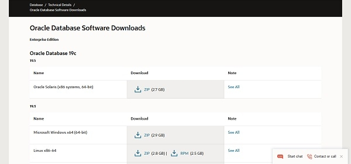

**Local DNS Resolver in CentOS 8:**

It is necessary to configure proper name resolution before installing Oracle Database 19c on CentOS 8 as well as other Linux distros.

If you are using a DNS server for your network then you can configure the name resolution within your DNS Server otherwise you can use **Local DNS Resolver** for name resolution of your Oracle database server.

Add the required name resolution directive in Local DNS Resolver **(/etc/hosts)** file.

[root@oracle-db-19c ~]# echo "192.168.116.206 oracle-db-19c.centlinux.com oracle-db-19c" >> /etc/hosts


## **Install Oracle Database 19c Prerequisites on CentOS 8:**
Oracle Database 19c requires some software packages, therefore, we are installing these packages before moving forward.

We can install Oracle Database 19c prerequisites using **dnf** command.

[root@oracle-db-19c ~]# dnf install -y bc \

\> binutils \

\> elfutils-libelf \

\> elfutils-libelf-devel \

\> fontconfig-devel \

\> glibc \

\> glibc-devel \

\> ksh \

\> libaio \

\> libaio-devel \

\> libXrender \

\> libXrender-devel \

\> libX11 \

\> libXau \

\> libXi \

\> libXtst \

\> libgcc \

\> librdmacm-devel \

\> libstdc++ \

\> libstdc++-devel \

\> libxcb \

\> make \

\> net-tools \

\> smartmontools \

\> sysstat \

\> unzip \

\> libnsl \

\> libnsl2

...

Installed:

`  `ksh-20120801-253.el8\_1.x86\_64

`  `libX11-1.6.7-1.el8.x86\_64

`  `libXau-1.0.8-13.el8.x86\_64

`  `libXi-1.7.9-7.el8.x86\_64

`  `libXrender-0.9.10-7.el8.x86\_64

`  `libXrender-devel-0.9.10-7.el8.x86\_64

`  `libXtst-1.2.3-7.el8.x86\_64

`  `libstdc++-devel-8.3.1-4.5.el8.x86\_64

`  `libxcb-1.13-5.el8.x86\_64

`  `sysstat-11.7.3-2.el8.x86\_64

`  `bc-1.07.1-5.el8.x86\_64

`  `binutils-2.30-58.el8\_1.2.x86\_64

`  `elfutils-libelf-devel-0.176-5.el8.x86\_64

`  `fontconfig-devel-2.13.1-3.el8.x86\_64

`  `glibc-devel-2.28-72.el8\_1.1.x86\_64

`  `libaio-devel-0.3.112-1.el8.x86\_64

`  `libnsl-2.28-72.el8\_1.1.x86\_64

`  `make-1:4.2.1-9.el8.x86\_64

`  `net-tools-2.0-0.51.20160912git.el8.x86\_64

`  `rdma-core-devel-22.3-1.el8.x86\_64

`  `smartmontools-1:6.6-3.el8.x86\_64

`  `unzip-6.0-41.el8.x86\_64

`  `libX11-common-1.6.7-1.el8.noarch

`  `libX11-devel-1.6.7-1.el8.x86\_64

`  `libX11-xcb-1.6.7-1.el8.x86\_64

`  `libXau-devel-1.0.8-13.el8.x86\_64

`  `libXext-1.3.3-9.el8.x86\_64

`  `libxcb-devel-1.13-5.el8.x86\_64

`  `xorg-x11-proto-devel-2018.4-1.el8.noarch

`  `bzip2-devel-1.0.6-26.el8.x86\_64

`  `dejavu-fonts-common-2.35-6.el8.noarch

`  `dejavu-sans-fonts-2.35-6.el8.noarch

`  `expat-devel-2.2.5-3.el8.x86\_64

`  `fontconfig-2.13.1-3.el8.x86\_64

`  `fontpackages-filesystem-1.44-22.el8.noarch

`  `freetype-devel-2.9.1-4.el8.x86\_64

`  `glibc-headers-2.28-72.el8\_1.1.x86\_64

`  `ibacm-22.3-1.el8.x86\_64

`  `kernel-headers-4.18.0-147.8.1.el8\_1.x86\_64

`  `libibumad-22.3-1.el8.x86\_64

`  `libibverbs-22.3-1.el8.x86\_64

`  `libpng-devel-2:1.6.34-5.el8.x86\_64

`  `librdmacm-22.3-1.el8.x86\_64

`  `libuuid-devel-2.32.1-17.el8.x86\_64

`  `libxcrypt-devel-4.1.1-4.el8.x86\_64

`  `lm\_sensors-libs-3.4.0-20.20180522git70f7e08.el8.x86\_64

`  `perl-Carp-1.42-396.el8.noarch

`  `perl-Errno-1.28-416.el8.x86\_64

`  `perl-Exporter-5.72-396.el8.noarch

`  `perl-File-Path-2.15-2.el8.noarch

`  `perl-IO-1.38-416.el8.x86\_64

`  `perl-PathTools-3.74-1.el8.x86\_64

`  `perl-Scalar-List-Utils-3:1.49-2.el8.x86\_64

`  `perl-Socket-4:2.027-3.el8.x86\_64

`  `perl-Text-Tabs+Wrap-2013.0523-395.el8.noarch

`  `perl-Unicode-Normalize-1.25-396.el8.x86\_64

`  `perl-constant-1.33-396.el8.noarch

`  `perl-interpreter-4:5.26.3-416.el8.x86\_64

`  `perl-libs-4:5.26.3-416.el8.x86\_64

`  `perl-macros-4:5.26.3-416.el8.x86\_64

`  `perl-parent-1:0.237-1.el8.noarch

`  `perl-threads-1:2.21-2.el8.x86\_64

`  `perl-threads-shared-1.58-2.el8.x86\_64

`  `rdma-core-22.3-1.el8.x86\_64

`  `zlib-devel-1.2.11-10.el8.x86\_64

Complete!


## **Create Users and Groups for Oracle Database 19c:**
Create Linux users and groups as required by Oracle Database 19c.

[root@oracle-db-19c ~]# groupadd -g 1501 oinstall

[root@oracle-db-19c ~]# groupadd -g 1502 dba

[root@oracle-db-19c ~]# groupadd -g 1503 oper

[root@oracle-db-19c ~]# groupadd -g 1504 backupdba

[root@oracle-db-19c ~]# groupadd -g 1505 dgdba

[root@oracle-db-19c ~]# groupadd -g 1506 kmdba

[root@oracle-db-19c ~]# groupadd -g 1507 racdba

[root@oracle-db-19c ~]# useradd -u 1501 -g oinstall -G dba,oper,backupdba,dgdba,kmdba,racdba oracle

[root@oracle-db-19c ~]# echo "oracle" | passwd oracle --stdin

Changing password for user oracle.

passwd: all authentication tokens updated successfully.


## **Set Security limits for Oracle user:**
Create **30-oracle.conf** configuration file in **/etc/security/limits.d** directory, to set the security limits for the **oracle** user.

[root@oracle-db-19c ~]# vi /etc/security/limits.d/30-oracle.conf

And add following directives therein.

oracle   soft   nofile    1024

oracle   hard   nofile    65536

oracle   soft   nproc    16384

oracle   hard   nproc    16384

oracle   soft   stack    10240

oracle   hard   stack    32768

oracle   hard   memlock    134217728

oracle   soft   memlock    134217728


## **Adjust Kernel Parameters in CentOS 8:**
Set the following Kernel parameters as required by the Oracle Database 19c.

Create **98-oracle.conf** configuration file in **/etc/sysctl.d** directory.

[root@oracle-db-19c ~]# vi /etc/sysctl.d/98-oracle.conf

And add set following Kernel parameters in this file.

fs.file-max = 6815744

kernel.sem = 250 32000 100 128

kernel.shmmni = 4096

kernel.shmall = 1073741824

kernel.shmmax = 4398046511104

kernel.panic\_on\_oops = 1

net.core.rmem\_default = 262144

net.core.rmem\_max = 4194304

net.core.wmem\_default = 262144

net.core.wmem\_max = 1048576

net.ipv4.conf.all.rp\_filter = 2

net.ipv4.conf.default.rp\_filter = 2

fs.aio-max-nr = 1048576

net.ipv4.ip\_local\_port\_range = 9000 65500

Reload Kernel parameters now by using **sysctl** command.

[root@oracle-db-19c ~]# sysctl -p


## **Configure SELinux Mode in CentOS 8:**
Persistently set SELinux mode to permissive.

[root@oracle-db-19c ~]# sed -i 's/^SELINUX=.\*/SELINUX=permissive/g' /etc/selinux/config

[root@oracle-db-19c ~]# setenforce permissive


## **Linux Firewall Configuration for Oracle Database 19c:**
Allow **Oracle SQL\* Net Listener** port **1521/tcp** in [CentOS 8 Firewall]().

[root@oracle-db-19c ~]# firewall-cmd --permanent --add-port=1521/tcp

success

[root@oracle-db-19c ~]# firewall-cmd --reload

success


## **Create Directories for Oracle Database 19c:**
To install Oracle Database 19c software, create the necessary directories and adjust the ownership and permissions on these directories.

[root@oracle-db-19c ~]# mkdir -p /u01/app/oracle/product/19.3.0/dbhome\_1

[root@oracle-db-19c ~]# mkdir -p /u02/oradata

[root@oracle-db-19c ~]# chown -R oracle:oinstall /u01 /u02

[root@oracle-db-19c ~]# chmod -R 775 /u01 /u02

Here, we have created two directories, **/u01** for the **Oracle RDBMS** and **/u02** for the **Oracle Databases**.


## **Configure Linux Environment for Oracle User:**
Connect as **oracle** user.

[root@oracle-db-19c ~]# su - oracle

[oracle@oracle-db-19c ~]$

Edit **oracle** user's **.bash\_profile**.

[oracle@oracle-db-19c ~]$ vi ~/.bash\_profile

And add following configurations at the end of this file.

\# Oracle Settings

export TMP=/tmp

export TMPDIR=$TMP

export ORACLE\_HOSTNAME=oracle-db-19c.centlinux.com

export ORACLE\_UNQNAME=cdb1

export ORACLE\_BASE=/u01/app/oracle

export ORACLE\_HOME=$ORACLE\_BASE/product/19.3.0/dbhome\_1

export ORA\_INVENTORY=/u01/app/oraInventory

export ORACLE\_SID=cdb1

export PDB\_NAME=pdb1

export DATA\_DIR=/u02/oradata

export PATH=$ORACLE\_HOME/bin:$PATH

export LD\_LIBRARY\_PATH=$ORACLE\_HOME/lib:/lib:/usr/lib

export CLASSPATH=$ORACLE\_HOME/jlib:$ORACLE\_HOME/rdbms/jlib

Execute **.bash\_profile** to set environment for the current session.

[oracle@oracle-db-19c ~]$ source ~/.bash\_profile


## **Install Oracle Database 19c on CentOS 8 in Silent mode:**
You can [download Oracle Database 19c]() from Oracle website. You need to create a free **Oracle Single Sign-On** account to login and download it.



We have downloaded **Oracle Database 19c (19.3)** for Linux and transferred it into **home** directory of **oracle** user.

Unzip the downloaded zip file to **ORACLE\_HOME** directory.
``` shell
[oracle@oracle-db-19c ~]$ unzip LINUX.X64\_193000\_db\_home.zip -d $ORACLE\_HOME
```
**Oracle Database 19c** installer have problems detecting **CentOS 8** operating system, however, we can workaround it, by setting an environment variable before starting installation.

``` shell
[oracle@oracle-db-19c ~]$ export CV\_ASSUME\_DISTID=RHEL8.0

Go to **ORACLE\_HOME** directory and start installation.

[oracle@oracle-db-19c ~]$ cd $ORACLE\_HOME

[oracle@oracle-db-19c dbhome\_1]$ ./runInstaller -ignorePrereq -waitforcompletion -silent \

\> oracle.install.option=INSTALL\_DB\_SWONLY \

\> ORACLE\_HOSTNAME=${ORACLE\_HOSTNAME} \

\> UNIX\_GROUP\_NAME=oinstall \

\> INVENTORY\_LOCATION=${ORA\_INVENTORY} \

\> ORACLE\_HOME=${ORACLE\_HOME} \

\> ORACLE\_BASE=${ORACLE\_BASE} \

\> oracle.install.db.InstallEdition=EE \

\> oracle.install.db.OSDBA\_GROUP=dba \

\> oracle.install.db.OSBACKUPDBA\_GROUP=backupdba \

\> oracle.install.db.OSDGDBA\_GROUP=dgdba \

\> oracle.install.db.OSKMDBA\_GROUP=kmdba \

\> oracle.install.db.OSRACDBA\_GROUP=racdba \

\> SECURITY\_UPDATES\_VIA\_MYORACLESUPPORT=false \

\> DECLINE\_SECURITY\_UPDATES=true


```

Launching Oracle Database Setup Wizard...

The response file for this session can be found at:

` `/u01/app/oracle/product/19.3.0/dbhome\_1/install/response/db\_2020-04-28\_02-44-19PM.rsp

You can find the log of this install session at:

` `/tmp/InstallActions2020-04-28\_02-44-19PM/installActions2020-04-28\_02-44-19PM.log

As a root user, execute the following script(s):

`        `1. /u01/app/oraInventory/orainstRoot.sh

`        `2. /u01/app/oracle/product/19.3.0/dbhome\_1/root.sh

Execute /u01/app/oraInventory/orainstRoot.sh on the following nodes:

[oracle-db-19c]

Execute /u01/app/oracle/product/19.3.0/dbhome\_1/root.sh on the following nodes:

[oracle-db-19c]


Successfully Setup Software.

Moved the install session logs to:

` `/u01/app/oraInventory/logs/InstallActions2020-04-28\_02-44-19PM

Connect as **root** user and execute post-installation scripts.

[oracle@oracle-db-19c dbhome\_1]$ su -

Password:

Last login: Tue Apr 28 14:09:02 PKT 2020 on pts/2

[root@oracle-db-19c ~]# /u01/app/oraInventory/orainstRoot.sh

Changing permissions of /u01/app/oraInventory.

Adding read,write permissions for group.

Removing read,write,execute permissions for world.

Changing groupname of /u01/app/oraInventory to oinstall.

The execution of the script is complete.

[root@oracle-db-19c ~]# /u01/app/oracle/product/19.3.0/dbhome\_1/root.sh

Check /u01/app/oracle/product/19.3.0/dbhome\_1/install/root\_oracle-db-19c.centlinux.com\_2020-04-28\_15-01-30-090367646.log for the output of root script

Oracle Database 19c has been installed on CentOS 8 server.


## **Create Oracle 19c Multitenant Database in Silent Mode:**
Start **Oracle Listener** by using following command.

[oracle@oracle-db-19c ~]$ lsnrctl start

LSNRCTL for Linux: Version 19.0.0.0.0 - Production on 28-APR-2020 15:04:29

Copyright (c) 1991, 2019, Oracle.  All rights reserved.

Starting /u01/app/oracle/product/19.3.0/dbhome\_1/bin/tnslsnr: please wait...

TNSLSNR for Linux: Version 19.0.0.0.0 - Production

Log messages written to /u01/app/oracle/diag/tnslsnr/oracle-db-19c/listener/alert/log.xml

Listening on: (DESCRIPTION=(ADDRESS=(PROTOCOL=tcp)(HOST=oracle-db-19c.centlinux.com)(PORT=1521)))

Connecting to (ADDRESS=(PROTOCOL=tcp)(HOST=)(PORT=1521))

STATUS of the LISTENER

\------------------------

Alias                     LISTENER

Version                   TNSLSNR for Linux: Version 19.0.0.0.0 - Production

Start Date                28-APR-2020 15:04:30

Uptime                    0 days 0 hr. 0 min. 0 sec

Trace Level               off

Security                  ON: Local OS Authentication

SNMP                      OFF

Listener Log File         /u01/app/oracle/diag/tnslsnr/oracle-db-19c/listener/alert/log.xml

Listening Endpoints Summary...

`  `(DESCRIPTION=(ADDRESS=(PROTOCOL=tcp)(HOST=oracle-db-19c.centlinux.com)(PORT=1521)))

The listener supports no services

The command completed successfully

Create Oracle 19c Multitenant database by using the following command.

[oracle@oracle-db-19c ~]$ dbca -silent -createDatabase \

\> -templateName General\_Purpose.dbc \

\> -gdbname ${ORACLE\_SID} -sid  ${ORACLE\_SID} \

\> -responseFile NO\_VALUE \

\> -characterSet AL32UTF8 \

\> -sysPassword V3ryStr@ng \

\> -systemPassword V3ryStr@ng \

\> -createAsContainerDatabase true \

\> -numberOfPDBs 1 \

\> -pdbName ${PDB\_NAME} \

\> -pdbAdminPassword V3ryStr@ng \

\> -databaseType MULTIPURPOSE \

\> -automaticMemoryManagement false \

\> -totalMemory 800 \

\> -storageType FS \

\> -datafileDestination "${DATA\_DIR}" \

\> -redoLogFileSize 50 \

\> -emConfiguration NONE \

\> -ignorePreReqs

Prepare for db operation

8% complete

Copying database files

31% complete

Creating and starting Oracle instance

32% complete

36% complete

40% complete

43% complete

46% complete

Completing Database Creation

51% complete

53% complete

54% complete

Creating Pluggable Databases

58% complete

77% complete

Executing Post Configuration Actions

100% complete

Database creation complete. For details check the logfiles at:

` `/u01/app/oracle/cfgtoollogs/dbca/cdb1.

Database Information:

Global Database Name:cdb1

System Identifier(SID):cdb1

Look at the log file "/u01/app/oracle/cfgtoollogs/dbca/cdb1/cdb1.log" for further details.

Connect as **root** user and execute following command to enable autostart of Oracle Databases.

[oracle@oracle-db-19c ~]$ su -

Password:

Last login: Tue Apr 28 15:01:17 PKT 2020 on pts/2

[root@oracle-db-19c ~]# sed -i 's/:N$/:Y/g' /etc/oratab

Connect to SQL Shell by using **sqlplus** command.

[oracle@oracle-db-19c ~]$ sqlplus / as sysdba

SQL\*Plus: Release 19.0.0.0.0 - Production on Tue Apr 28 15:57:06 2020

Version 19.3.0.0.0

Copyright (c) 1982, 2019, Oracle.  All rights reserved.


Connected to:

Oracle Database 19c Enterprise Edition Release 19.0.0.0.0 - Production

Version 19.3.0.0.0

SQL>

Enable **Oracle Managed File (OMF)** to simplify the creation of databases and database files.

SQL> ALTER SYSTEM SET DB\_CREATE\_FILE\_DEST='/u02/oradata' SCOPE=BOTH;

System altered.

Enable autostart of Pluggable databases with startup of Container Database.

SQL> ALTER PLUGGABLE DATABASE PDB1 SAVE STATE;

Pluggable database altered.


## **Create SystemD Service for Oracle Database 19c on CentOS 8:**
To configure autostart of Oracle Database 19c on CentOS 8, we have to write a **SystemD** service.

[root@oracle-db-19c ~]# vi /usr/lib/systemd/system/dbora.service

Add following lines of code in this file.

[Unit]

Description=Oracle Database Service

After=network.target


[Service]

Type=forking

ExecStart=/u01/app/oracle/product/19.3.0/dbhome\_1/bin/dbstart /u01/app/oracle/product/19.3.0/dbhome\_1

ExecStop=/u01/app/oracle/product/19.3.0/dbhome\_1/bin/dbshut /u01/app/oracle/product/19.3.0/dbhome\_1

User=oracle

TimeoutSec=300s


[Install]

WantedBy=multi-user.target

Execute following command to inform **SystemD** about changes in unit files.

[root@oracle-db-19c ~]# systemctl daemon-reload

Enable and start Oracle Database 19c service.

[root@oracle-db-19c ~]# systemctl enable --now dbora.service

Created symlink /etc/systemd/system/multi-user.target.wants/dbora.service â /usr/lib/systemd/system/dbora.service.

Verify the status of the Oracle Database 19c service.

[root@oracle-db-19c ~]# systemctl status dbora.service

â dbora.service - Oracle Database Service

`   `Loaded: loaded (/usr/lib/systemd/system/dbora.service; enabled; vendor prese>

`   `Active: active (running) since Tue 2020-04-28 16:01:39 PKT; 3s ago

`  `Process: 27957 ExecStart=/u01/app/oracle/product/19.3.0/dbhome\_1/bin/dbstart >

`    `Tasks: 57 (limit: 12367)

`   `Memory: 1.0G

`   `CGroup: /system.slice/dbora.service

`           `ââ28067 ora\_pmon\_cdb1

`           `ââ28069 ora\_clmn\_cdb1

`           `ââ28071 ora\_psp0\_cdb1

`           `ââ28073 ora\_vktm\_cdb1

`           `ââ28077 ora\_gen0\_cdb1

`           `ââ28079 ora\_mman\_cdb1

`           `ââ28083 ora\_gen1\_cdb1

`           `ââ28086 ora\_diag\_cdb1

`           `ââ28088 ora\_ofsd\_cdb1

`           `ââ28091 ora\_dbrm\_cdb1

`           `ââ28093 ora\_vkrm\_cdb1

`           `ââ28095 ora\_svcb\_cdb1

`           `ââ28097 ora\_pman\_cdb1

`           `ââ28099 ora\_dia0\_cdb1

`           `ââ28101 ora\_dbw0\_cdb1

`           `ââ28103 ora\_lgwr\_cdb1

We have successfully installed Oracle Database 19c on CentOS 8 server and created a Multitenant Database in this server.

